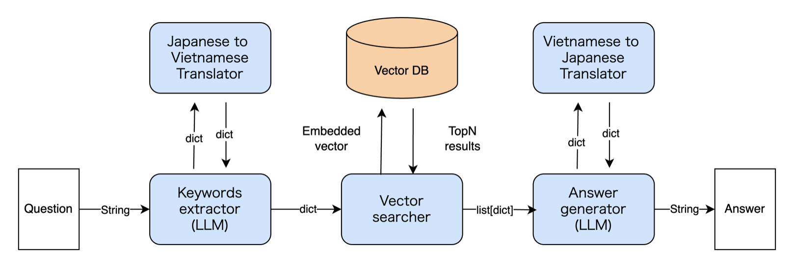

# RAG_Agriculture
Retrieval augmented generation using LLM for Agriculture knowledge graph for Japanese.



## config.json
さまざまなファイルの設定が書き込んであるファイル。`main.py`と`prepare_vector_db.py`で読み込む。

```json
{
    "retrieve_llm":"gpt-3.5-turbo",
    "extract_keywords_prompt_path":"./prompts/extract_keywords_prompt.txt",
    "generate_llm":"gpt-3.5-turbo",
    "generate_answer_prompt_path":"./prompts/generate_answer_prompt.txt",
    "embedding_model":"intfloat/multilingual-e5-large",
    "search_num":30,
    "from_ja_translator_url":"http://localhost:5001/translate/from_ja",
    "to_ja_translator_url":"http://localhost:5001/translate/to_ja",

    "weaviate":{
        "vector_columns":{
            "task_name": "作業名",
            "purpose": "目的(ja)",
            "action": "行為(ja)",
            "target": "対象(ja)",
            "sub_target": "副対象(ja)",
            "crop_example": "生産対象(ja)"
        },
        "rule_based_columns":{
            "first": "第1階層",
            "second": "第2階層",
            "third": "第3階層",
            ...
        },
        "prompt_only_columns":{
            "aao_id": "ID",
            "reading": "よみ",
            "notation": "|表記|",
            ...
        },
        "data_path": "./datasets/aao_ver_4_05.csv",
        "schema":{
            "class": "Agriculture",
            "description": "農作業基本オントロジーに関するデータ。URL:https://cavoc.org/aao/ns/4/A1.html",
            "vectorizer": "none",
            "moduleConfig": {
                "text2vec-contextionary": {
                    "vectorizeClassName": true
                }
            },
            "properties":[
                {
                    "name": "task_name",
                    "dataType": ["text"],
                    "moduleConfig": {           
                        "text2vec-contextionary": {
                            "vectorizePropertyName": true
                        }
                    }
                },
                {
                    "name": "purpose",
                    "dataType": ["text"],
                    "moduleConfig": {           
                        "text2vec-contextionary": {
                            "vectorizePropertyName": true
                        }
                    }
                },
                {
                    "name": "action",
                    "dataType": ["text"],
                    "moduleConfig": {           
                        "text2vec-contextionary": {
                            "vectorizePropertyName": true
                        }
                    }
                },


```
それぞれのモデルの選択肢は以下の通り。
* retrieve_llm: gpt-3.5-turbo, gpt-4o
* embedding_model: openai（行が多すぎるとリクエスト制限に引っかかる）, intfloat/multilingual-e5-large
* generate_llm: gpt-3.5-turbo, gpt-4o
### 使用するLLMやシステム全体の設定
* retrieve_llm:質問からキーワードを抽出するためのLLM（例: "gpt-3.5-turbo", "gpt-4o"）。
* extract_keywords_prompt_path:キーワード抽出用LLMのプロンプトファイルのパス。
* generate_llm:解答生成に使用するLLM（例: "gpt-3.5-turbo", "gpt-4o"）。
* generate_answer_prompt_path:解答生成用プロンプトファイルのパス。
* embedding_model:埋め込みモデル（例: "openai"）。
* search_num:ベクトル検索で取得するオブジェクト数（例: 5）。

### Weaviate設定
* target_columns:Weaviateのプロパティ名とデータセットのカラム名の対応。
* vector_columns: Weaviate でのベクトル検索に使用するカラム
* rule_based_columns: ベクトル検索には使用しないが、検索語のRerankで使用する（予定）のカラム
* prompt_only_columns: 回答生成時にのみ使用する予定のカラム
* "task_name": 作業名
* "purpose": 目的（日本語）
* "action": 行為（日本語）
他同様の項目...
* data_path:農作業オントロジーデータのCSVファイルのパス。prepare_vector_db.pyによりデータベースを構築するときに使用。

### Weaviateスキーマ設定
* class:コレクションのクラス名（例: "Agriculture"）。
* description:クラスの説明文。
* vectorizer:使用するベクトル化モジュール（例: "text2vec-openai"）。
* properties:コレクションのプロパティ設定（例: "task_name", "purpose"）。

## 使い方
全てベースディレクトリ（このREADME.md と同じディレクトリ）からの実行を前提とする。
農作業オントロジーとLLMを使用した対話システムを使用するいは以下の流れで進めていく。

### OpenAI APIの準備
OpenAIのAPIを使用する場合、OpenAIのサイトでアカウントを作り、APIの契約をする必要がある。デポジット性で使用前にお金を払っておく必要があることに注意。契約後、OpenAIのAPIキーを自身の環境で環境変数として以下のように設定。

```
export OPENAI_API_KEY={Your API key}
```

### Weaviate の Docker を立てるコマンド
Weaviate のベクトルDBを配置するDockerコンテナを用意。

```
docker compose up
```

### 農作業オントロジーデータをベクトルDBにセット
以下のコマンドで、csv形式の農作業オントロジーデータをベクトルDBにセットする。OpenAIの埋め込みモデルを使用する場合は以下のスクリプトを実行。
```
python prepare_vector_db.py
```

Hugging face で公開されているOSS埋め込みモデルを使用する際は以下のスクリプトを実行。
```
python prepare_vector_db_oss.py
```

### translatorの起動
日本語以外での検索を可能にするためのtranslaatorを起動する必要がある。以下のコマンドでflaskによるサーバーが立ち上がる。中身は、googletransという無料の翻訳機。
```
python RAG_Agriculture/translator.py
```

### 質問システムの起動
以下のコマンドで、RAG質問システムが起動

```
python main.py
```


## test.py によるテスト
test.py ファイルを実行することで、RAGシステムのテストをまとめて行うことができる。実行コマンドは以下の通り。
```
python test.py {質問が書かれたテキストファイルがまとめてあるディレクトリへのパス}
```
動作は以下の通り。
* 指定したディレクトリ内のテキストファイルをすべて探索し、質問をすべて抽出
* outputというディレクトリを質問ディレクトリと同じ階層に作成し、configファイルと出力およびログを保存
* outputディレクトリに使用したプロンプトをコピー

## 各モジュールの簡単な説明
RAG_Agriculuture ディレクトリの中にモジュールが格納されている。

### keywords_extractor
質問文から農作業オントロジーデータの項目に合わせてkeywardを抜き出すモジュール
* 入力：質問文（str）
* 出力：キーワード辞書（dict）

### vector_searcher
キーワード辞書を使用して、ベクトル検索を行い、ヒットした上位のオブジェクトをリスト形式で返すモジュール
* 入力：キーワード辞書（dict）
* 出力：ヒットしたオブジェクトのリスト（list）

### answer_generator
検索システムにより抜き出してきた情報と質問文を組み合わせて解答を生成するモジュール
* 入力：質問文（str）、ヒットしたオブジェクトのリスト（list）
* 出力：生成データ

### utils
モジュール共通で使用するクラスや関数をまとめて置いてある。

## prompts
各LLMに与えるための初期プロンプト。

### extract_keywords_prompt.txt
質問を入力とし、そこからキーワードを抽出するLLMのためのプロンプト。
日本語で書かれている。

### generate_answer_prompt.txt
RAGにより検索して返ってきたドキュメントに加えて、回答生成用のLLMに与えるためのプロンプト。日本語で書かれている。

### extract_keywords_prompt_{language}.txt, generate_answer_prompt_{language}.txt
上記2プロンプトの日本語以外のもの。
{language}語で書かれている。言語の命名規則に従わないとエラーが発生。
命名規則はgoogletransライブラリの言語の表記に準拠。
日本語で使用する分には作成する必要はない。
* 英語：{language}=en
* ベトナム語：{language}=vi

